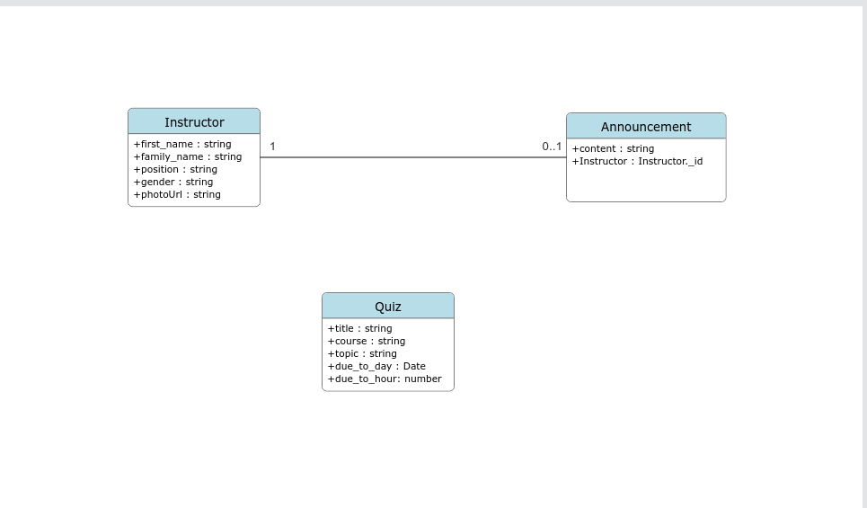
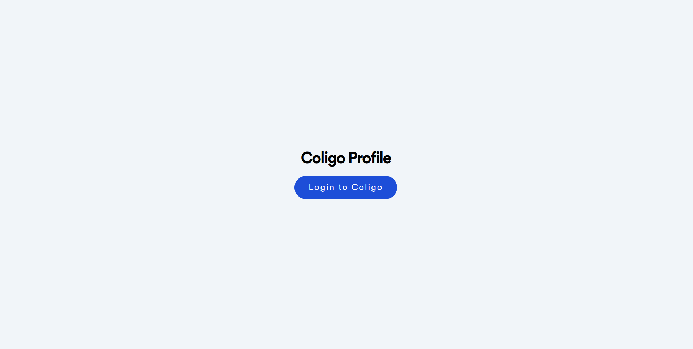
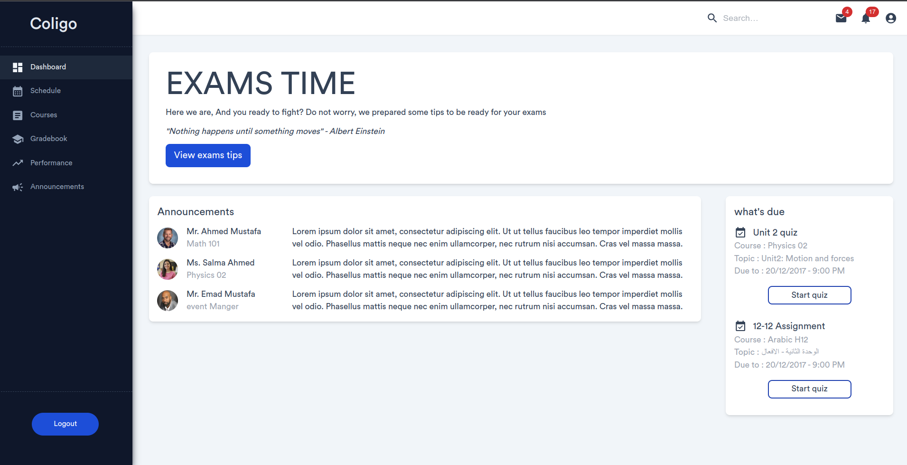
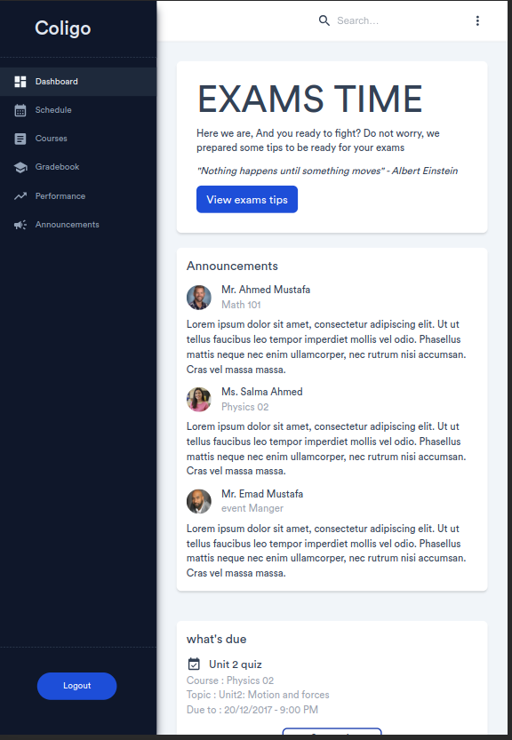
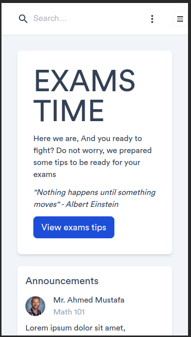

# dashboard_anywhere
A web app for presenting student quizzes and announcements data for the current semester using React and Node.

Built with a bunch of things, but to name a few:

- [Vite](https://vitejs.dev/)
- [Express](https://expressjs.com/)
- [Reach Router](https://reach.tech/router)
- [Tailwind](https://tailwindcss.com/)
- [TypeScript](https://www.typescriptlang.org/)
- [Mongoose](https://mongoosejs.com/)
- [MUI](https://mui.com/) : Icons and app bar
- [Rewind-ui](https://rewind-ui.dev/) : The side bar
- [Axios](https://axios-http.com/)

## UML Diagram

## Screenshots 

